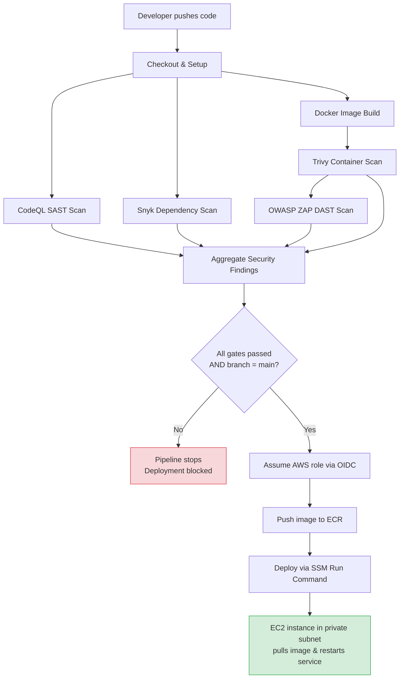
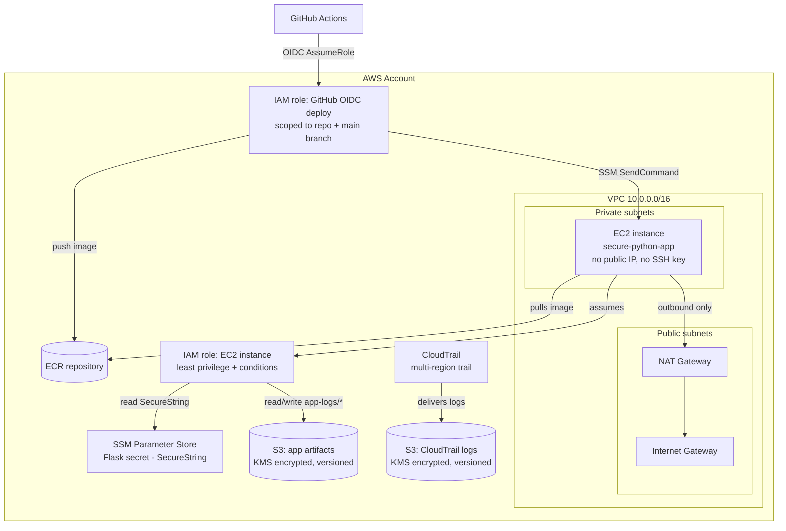

# Secure Python Application Pipeline with GitHub Actions and AWS

A production-style DevSecOps CI/CD pipeline that gates every deployment of a Python Flask application behind SAST, dependency, container, and DAST security scans before provisioning AWS infrastructure with Terraform.


> Replace `jm5579/secure-python-app-pipeline` in the badge URLs above with your actual GitHub path once this repository is pushed - badges render live from the repo they live in.

---

## Table of contents

- [Architecture](#architecture)
- [Security tools](#security-tools)
- [Prerequisites](#prerequisites)
- [Complete setup instructions](#complete-setup-instructions)
- [Pipeline stages](#pipeline-stages)
- [Supply chain security](#supply-chain-security)
- [AI pipeline security](#ai-pipeline-security)
- [Security findings examples](#security-findings-examples)
- [Terraform infrastructure](#terraform-infrastructure)
- [Future improvements](#future-improvements)
- [Repository topics](#repository-topics)
- [Adding pipeline screenshots](#adding-pipeline-screenshots)
- [License](#license)

---

## Architecture



Every arrow into **Aggregate Security Findings** represents a hard gate: if the job it comes from fails, the `deploy` job's `needs:` list is never satisfied and GitHub Actions will not run it. There is no path from a push to AWS that skips a scan.

## Security tools

| Tool | Scans for | What it catches | Blocks deployment on |
|---|---|---|---|
| **CodeQL** | Static application code (SAST) | Injection flaws, unsafe deserialization, hardcoded credentials, path traversal, and other CWE-classed code patterns | Any `security-extended` alert at error severity |
| **Snyk** | Python dependencies (`requirements.txt`) | Known CVEs in third-party packages, license issues | Critical severity (`--severity-threshold=critical`) |
| **Trivy** | Built container image (OS packages + app layer) | OS-level CVEs, misconfigurations, exposed secrets baked into layers | Critical or high severity (unfixed CVEs excluded) |
| **OWASP ZAP** | Running application (DAST) | Missing security headers, reflected/stored XSS, exploitable endpoints observable only at runtime | Any alert at or above the configured baseline threshold |
| **GitHub secret scanning** | Every commit, push-protected | Accidentally committed API keys, tokens, and credentials | Push is rejected at the Git level before it reaches CI |

## Prerequisites

Exact versions this project was built and tested against:

| Tool | Version | Purpose |
|---|---|---|
| Python | 3.12.x | Application runtime |
| Docker | 24.x+ (Docker Desktop or Engine) | Local image builds |
| Terraform | 1.7.x+ | Infrastructure provisioning |
| AWS CLI | 2.15.x+ | AWS auth, SSM commands |
| Git | 2.40+ | Version control |
| A Snyk account | free tier is sufficient | Dependency scanning token |
| An AWS account | with permission to create IAM/VPC/EC2/S3 resources | Target deployment account |
| GitHub repository | with Actions enabled | Pipeline execution |

## Complete setup instructions

A junior engineer following these steps should have the pipeline green end-to-end in under 30 minutes.

**1. Fork/clone the repository (2 min)**
```bash
git clone https://github.com/jm5579/secure-python-app-pipeline.git
cd secure-python-app-pipeline
```

**2. Bootstrap the Terraform state backend - run once (5 min)**
```bash
cd terraform/bootstrap
terraform init
terraform apply -var="state_bucket_name=jm5579-secure-python-app-tfstate"
# note the two outputs: state_bucket_name and lock_table_name
cd ../..
```

**3. Configure the main Terraform backend and variables (5 min)**
```bash
cd terraform
cp backend.hcl.example backend.hcl        # fill in the bootstrap outputs
cp terraform.tfvars.example terraform.tfvars  # fill in your values
terraform init -backend-config=backend.hcl
```

**4. Register the GitHub OIDC provider and apply infrastructure (8 min)**
```bash
terraform plan   # review before applying to a shared/production account
terraform apply
# note the github_actions_deploy_role_arn output
cd ..
```

**5. Set the Flask secret key in SSM (2 min)**
```bash
aws ssm put-parameter \
  --name "/secure-python-app/flask-secret-key" \
  --value "$(openssl rand -hex 32)" \
  --type SecureString --overwrite --region ca-central-1
```

**6. Configure GitHub Actions secrets (3 min)**

Follow [`docs/SECRETS.md`](docs/SECRETS.md) to add `SNYK_TOKEN`,
`AWS_DEPLOY_ROLE_ARN` (from step 4), and `CI_TEST_FLASK_SECRET_KEY`.

**7. Push to `main` and watch it run (5 min)**
```bash
git push origin main
```
Open the **Actions** tab - you should see all eight stages run in order, with the `deploy` job only starting once every security job above it shows a green check.

## Pipeline stages

| Stage | What it does | What a failure looks like | How to fix it |
|---|---|---|---|
| Checkout & Setup | Checks out code, installs Python + dependencies | `pip install` fails | Check `requirements.txt` for a typo'd package name/version |
| CodeQL SAST | Static analysis of the Flask app source | Job fails, alert appears under Security > Code scanning | Open the alert, apply the suggested fix (e.g. remove `shell=True`), push again |
| Snyk Dependency Scan | Scans `requirements.txt` against Snyk's vulnerability database | Job fails with a CVE ID and severity in the log | Bump the pinned version in `requirements.txt` to the patched release Snyk recommends |
| Docker Image Build | Builds the image via Buildx, does not push yet | Build fails, usually a Dockerfile syntax or missing-file error | Reproduce locally with `docker build .` and read the layer that failed |
| Trivy Container Scan | Scans the built image for OS/package CVEs | Job fails listing CRITICAL/HIGH CVEs with a package name | Update the base image tag/digest in the Dockerfile, or add the package to an explicit upgrade step |
| OWASP ZAP DAST | Runs the container and actively probes it over HTTP | Job fails, `report_html.html` artifact lists the alert (e.g. missing header) | Add the missing security header/config in `app.py`, or tune `.zap/rules.tsv` with a documented, reviewed exception |
| Aggregate Security Findings | Collects every tool's output into one artifact/summary | Rarely fails itself; reflects the state of jobs above | Check `security-findings-report` artifact for the full picture |
| Deploy to AWS EC2 | Pushes to ECR, restarts the service via SSM | `needs:` unmet (never starts) or SSM command fails | If it never starts, check which upstream job failed; if SSM fails, check the target instance is running and tagged `Name=secure-python-app` |

## Supply chain security

**Dependency pinning.** `requirements.txt` pins every package to an exact version (`==`), not a floating range. A floating range means the *next* `pip install` can silently pull in a different, potentially compromised or broken release without any code change or review - a real attack vector seen in incidents like the `event-stream` and `ua-parser-js` npm compromises. Exact pins mean nothing changes without a deliberate commit that a reviewer and Snyk both see.

**Why this matters more in regulated financial environments.** A federally regulated institution typically has to demonstrate, on request, exactly what software (and what version of it) was running in production at a given point in time, and that it was scanned before deployment. Pinned dependencies plus a scan gate plus a 90-day-retained findings artifact (see the `security-report` job) gives you that evidence trail without extra tooling.

**SBOM concepts.** A Software Bill of Materials is a machine-readable inventory of every component (direct and transitive) that makes up a build - similar in spirit to an ingredients list. This project's pinned `requirements.txt` plus the Snyk/Trivy SARIF artifacts function as an informal SBOM today; a natural next step (see Future Improvements) is generating a formal CycloneDX or SPDX SBOM as its own pipeline artifact, which is increasingly expected under frameworks like NIST SSDF and Executive Order 14028-aligned procurement requirements that Canadian financial institutions' vendors are starting to see flow down from US-linked supply chains.

## AI pipeline security

This project is a conventional Flask application, not an ML service - but the same pipeline pattern generalizes directly to Python applications that call or serve AI models, which is increasingly common even in traditional line-of-business apps (e.g. a fraud-scoring microservice calling a hosted model, or a support tool embedding a local Hugging Face model). Three risks are specifically relevant:

1. **Dependency vulnerabilities in ML packages.** Libraries like `torch`, `transformers`, and `numpy` have historically shipped CVEs in areas like unsafe deserialization (`torch.load`, pickle-based model loading) that can lead to remote code execution when loading an untrusted model file. The same Snyk gate that scans this project's `requirements.txt` would scan a `torch`/`transformers` pin exactly the same way, at the same critical-severity threshold, before that dependency ever reaches a container.
2. **Secrets leakage in model configuration files.** Model config/weights repos frequently include `.env`, API keys for a model hub, or embedded tokens in notebook checkpoints. GitHub secret scanning (enabled at the repository level in this project) and Trivy's filesystem/secret scanning would need to be pointed at any such config directory the same way this project's `.dockerignore`/`.gitignore` exclude `.env` from ever entering a commit or a build context.
3. **Container security for model-serving infrastructure.** A model-serving container (e.g. a `torchserve` or FastAPI+`transformers` image) benefits from the exact same hardening applied to this project's Dockerfile: a minimal, digest-pinned base image, a non-root user, no baked-in credentials, and a Trivy gate blocking on critical/high CVEs before the image is ever pushed to ECR. The larger attack surface of ML base images (CUDA libraries, larger OS package sets) makes that Trivy gate proportionally more important, not less.

In short: this pipeline's architecture - pin, scan, gate, deploy-only-on-green - is intentionally tool-and-workload agnostic, and the same eight stages apply whether the target is a plain Flask app or a model-serving one.

## Security findings examples

### Snyk (dependency scan) - example output

```
Testing requirements.txt...

✗ High severity vulnerability found in werkzeug
  Description: Improper Input Validation
  Info: https://snyk.io/vuln/SNYK-PYTHON-WERKZEUG-XXXXXXX
  Introduced through: werkzeug@2.2.2
  Fix: Upgrade to werkzeug@2.2.3 or later

Organization:      your-org
Package manager:   pip
Target file:        requirements.txt
Open source:        no
Project path:        requirements.txt

Tested 7 dependencies for known vulnerabilities, found 1 vulnerability.
```

**How to interpret it:** Snyk names the exact package and pinned version, links to the advisory, and states the minimum version that fixes it. Because the pin is exact (`werkzeug==2.2.2`), the fix is a one-line diff to `requirements.txt` - bump the pin, commit, let the pipeline re-scan.

### Trivy (container scan) - example output

```
secure-python-app:abc1234 (debian 12.5)
=========================================
Total: 2 (CRITICAL: 1, HIGH: 1)

┌────────────┬────────────────┬──────────┬─────────────────┬─────────┐
│  Library   │ Vulnerability  │ Severity │ Installed Version│ Fixed   │
├────────────┼────────────────┼──────────┼─────────────────┼─────────┤
│ libssl3    │ CVE-2024-XXXXX │ CRITICAL │ 3.0.11-1         │ 3.0.13-1│
│ zlib1g     │ CVE-2023-XXXXX │ HIGH     │ 1.2.13.dfsg      │ 1.3.dfsg│
└────────────┴────────────────┴──────────┴─────────────────┴─────────┘
```

**How to interpret it:** these are OS-level packages inherited from the base image, not application code. The fix is almost always to bump the base image digest in the `Dockerfile` to a newer build that already includes the patched package, then rebuild - Trivy re-scans automatically on the next push.

### Example: a caught application vulnerability and its remediation

The `/diagnostics` endpoint in `app/app.py` is intentionally left in this repository as a demonstration target. It builds a shell command by string-interpolating an untrusted `host` query parameter:

```python
command = f"ping -c 1 {host}"
result = subprocess.run(command, shell=True, capture_output=True, text=True, timeout=5)
```

**What CodeQL reports:** a `py/command-line-injection` alert at error severity, pointing at the `subprocess.run` call, because attacker-controlled data flows into a shell command with `shell=True`.

**Why it's exploitable:** a request like `GET /diagnostics?host=127.0.0.1;%20cat%20/etc/passwd` would run a second, attacker-chosen command after the semicolon, because the string is handed to `/bin/sh` rather than treated as a single argument.

**Remediation applied in this repo:** the `/lookup` endpoint immediately above it in `app.py` implements the safe equivalent - `socket.gethostbyname(host)` - which never invokes a shell at all, so no amount of input can reach one. The general fix pattern is: avoid `shell=True` entirely, and when a subprocess truly is necessary, pass arguments as a list (`subprocess.run(["ping", "-c", "1", host])`) so the OS never re-parses the string through a shell.

## Terraform infrastructure



**Module structure:**
```
terraform/
├── bootstrap/        # one-time: creates the remote state S3 bucket + DynamoDB lock table
├── backend.tf         # S3 backend configuration (values supplied via backend.hcl)
├── main.tf             # wires modules together
├── variables.tf        # root input variables
├── outputs.tf           # root outputs (role ARNs, IDs)
└── modules/
    ├── vpc/            # VPC, public/private subnets, route tables, NAT, flow logs
    ├── s3/               # encrypted, versioned, public-access-blocked bucket (reused for app + CloudTrail)
    ├── iam/              # EC2 instance role + GitHub OIDC deploy role, both least-privilege
    └── ec2/               # instance, security group, CloudTrail trail
```

## Future improvements

Six realistic enhancements a senior engineer reviewing this project would suggest next:

1. **Multi-AZ NAT Gateways** - currently a single NAT Gateway is used to control cost; production would use one per AZ to remove the cross-AZ single point of failure.
2. **Formal SBOM generation** - add a CycloneDX or SPDX SBOM generation step (e.g. `syft`) as its own pipeline artifact, distinct from the Snyk/Trivy scan output, for procurement and audit requests.
3. **Application Load Balancer + WAF** - front the EC2 instance with an ALB and AWS WAF (with managed rule groups) instead of a single security-group-scoped ingress path, enabling TLS termination, health-check-based failover, and request-level filtering.
4. **Auto Scaling Group** - replace the single `aws_instance` with an ASG behind the ALB above for zero-downtime deploys and self-healing on instance failure.
5. **SSM Patch Manager / automated AMI rebuilds** - schedule automatic OS patching so long-running instances don't drift from the "latest AMI at launch" security posture this project currently relies on.
6. **Policy-as-code scanning of the Terraform itself** - add `tfsec` or `checkov` as an additional pipeline gate on the `terraform/` directory, so infrastructure misconfigurations are caught pre-apply, the same way CodeQL/Snyk/Trivy catch application-level issues pre-deploy.

## Repository topics

Suggested GitHub repository topics for discoverability:

`devsecops` `ci-cd` `github-actions` `aws` `terraform` `python` `flask` `docker` `security` `sast` `dast` `snyk` `trivy` `owasp-zap` `codeql` `infrastructure-as-code` `cloud-security` `supply-chain-security` `fintech-security`

## Adding pipeline screenshots

1. Push this repository to GitHub and let one full pipeline run complete.
2. In the **Actions** tab, open the completed run and screenshot the job graph showing all eight stages green (or the security gates in red, if you want to show a blocked deployment for the demo).
3. Open the **Security > Code scanning** tab and screenshot a CodeQL/Trivy finding to show it surfaced correctly.
4. Download the `security-findings-report` artifact from a run and screenshot `SUMMARY.md`.
5. Save all screenshots into `docs/screenshots/` (already present in this repo) using descriptive names, e.g. `docs/screenshots/pipeline-run-all-green.png`, then embed them in this README with standard Markdown image syntax: ``.

## License

Released under the [MIT License](LICENSE).
